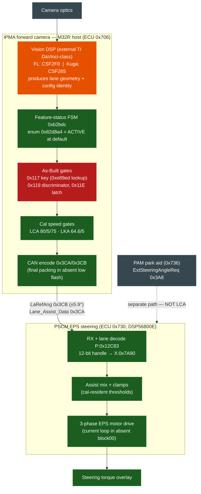

# LCA chain — visual map (works / gated / missing)

Companion to `LCA_GAP_ANALYSIS.md`. The full lane-centering signal chain from camera to steering, with
each node marked by its verified status. Renders on GitHub (Mermaid). Static analysis only.

## Legend

- 🟢 **green — works / equivalent to the working reference** (Pre-FL PSCM & Kuga CV4T): the feature-status
  FSM computes ACTIVE, the speed gates are present and identical, the CAN encode exists, and the PSCM
  decodes/applies `LaRefAng` byte-identically (modulo relocation) down to the motor drive.
- 🔴 **red — the gate that breaks it:** the IPMA **As-Built lane records** (`0x117` primary key, `0x119`
  discriminator) are at their unprovisioned default on this car, so the `0xe89ed` key-lookup fails and the
  lane subfields publish **degraded**. **Coding-addressable** (see `LCA_CODING_ACTION_SHEET.md`).
- 🟠 **orange — the residual, non-codeable difference:** the **CSF2F0 vs CSF265 vision DSP**. It produces
  the config identity/gate the host consumes; if the FL DSP build is not LCA-capable, coding alone cannot
  restore centering.
- ⚫ **grey — out of the LCA loop:** the camera front-end and the PAM park-aid steering path (`0x3A8`),
  which is proven separate from the lane path (`0x3CB`).

## One-line reading
Everything on the chain works or is equivalent to a working car **except** the red node — the
unprovisioned IPMA As-Built lane key — with the orange DSP node as the only thing that could still block
LCA after correct coding.
